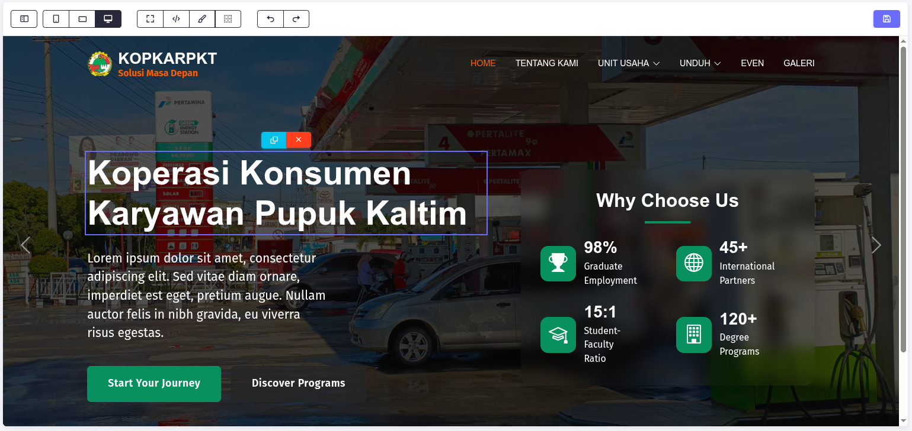

# EVAPageBuilder

**EVAPageBuilder** is a modular drag-and-drop HTML editor using iframe-based isolation, block system, and editable zones.


## 🖼️ Screenshot


## 🎯 Features
- Drag & Drop inside iframe
- Draggable Style Manager
- Undo/Redo feature
- Code editor with read-only zones
- Device switcher `desktop/mobile/landscape`
- Custom block categories & previews
- Add custom buttons
- Multi-instance support `run multiple editors independently`
- Support with Bootstrap `Bootstrap 5.3.3 strong recomended`
- Support with Ajax, PHP, etc

## 🧰 Requirements
- **Modern Browser**: Chrome, Firefox, Edge (latest version recommended)  
- **JQuery**: Required for full functionality  
- **CodeMirror 5.65.13**: For the code editor integration  
- **Bootstrap 5.3.3**: (Optional but strongly recommended) for layout and component styling  
- [**EVAFileManager**](https://github.com/tepra/EvaFileMan): For file picker  
- **Web Server (Local or Remote)**: Required for AJAX + PHP integration  
- **PHP 7+**: Required if you use the provided `save.php` integration  

## 🤝 Contributing
EVAPageBuilder is an open-source project. Feel free to fork, submit issues, or contribute via pull requests on GitHub.  
[GitHub Repository](https://github.com/tepra/EvaEditor)

## 📦 Installation

These libraries are **required** to run EVAPageBuilder properly:

### 🔧 EVAPageBuilder Core
```html
<script src="EVAPageBuilder.js"></script>
<script src="EvaEditorHelper.js"></script>
```

### 🧠 Code Editor (CodeMirror)
```html
<link rel="stylesheet" href="https://cdnjs.cloudflare.com/ajax/libs/codemirror/5.65.13/codemirror.min.css">
<link rel="stylesheet" href="https://cdnjs.cloudflare.com/ajax/libs/codemirror/5.65.13/theme/material-darker.min.css">

<script src="https://cdnjs.cloudflare.com/ajax/libs/codemirror/5.65.13/codemirror.min.js"></script>
<script src="https://cdnjs.cloudflare.com/ajax/libs/codemirror/5.65.13/mode/xml/xml.min.js"></script>
<script src="https://cdnjs.cloudflare.com/ajax/libs/codemirror/5.65.13/mode/javascript/javascript.min.js"></script>
<script src="https://cdnjs.cloudflare.com/ajax/libs/codemirror/5.65.13/mode/css/css.min.js"></script>
<script src="https://cdnjs.cloudflare.com/ajax/libs/codemirror/5.65.13/mode/htmlmixed/htmlmixed.min.js"></script>
<script src="https://cdnjs.cloudflare.com/ajax/libs/codemirror/5.65.13/addon/edit/closetag.min.js"></script>
<script src="https://cdn.jsdelivr.net/npm/js-beautify@1.14.7/js/lib/beautify-html.min.js"></script>
```

### 🎨 Your Frame CSS/JS (Used Inside iframe)
```html
<link rel="stylesheet" href="builder.css">
<script src="script.js"></script>
```

Place them inside your `<head>` or load them dynamically via `frameConfig` inside `EvaPageEditor.init()`.

## 🚀 Initialization **HTML file**
### ✅ Example
```html
<div id="evaBuilder" class="eva-builder card mb-6">
  <div class="row g-0">
    <div class="col eva-builder-sidebar border-end flex-grow-0">
      <div class="eva-builder-panel ps"></div>
    </div>
    <div class="col">
      <div class="eva-builder-menu card shadow-none border-0 rounded-0"></div>
      <div class="eva-builder-frame d-flex justify-content-center"></div>
    </div>
  </div>
</div>
```

## 🚀 Initialization **script.js**
```js
const evaEditor = EvaPageEditor.init({
  container: "#evaBuilder", // Main editor container 
  frameConfig: {
    css: [
      //'your website css',
      //'your website css'
    ],
    js: [
      //'your js in html head',
      //'your js in html head'
    ],
    jsOnBody: [
      // your js in html body
    ],
    backgroundColor: "#060606" // Comment out code when it’s not needed.
  },
  sidebarSelector: {
    container: ".eva-builder-sidebar",
    deviceSwitcher: {
      // You can set your own size
      "smartphone-portrait": { width: "375px", height: "667px" },
      "smartphone-landscape": { width: "667px", height: "375px" },
      "desktop": { width: "100%", height: "600px" }
    }
  },
  codeEditor: {
    readOnly: [ "footer" ],
    editable: [ "header#header" ]
  },
  defaultSelectedElement: "nav#navMenu ul",
  actionBtn: {
    save: true,
    delete: true,
    clear: true
  },
  onDeviceSwitch: (type) => {
    // Perform any additional actions needed upon screen change.
    ...
  },
  onLoad: () => {
    // Perform additional actions after the frame is fully loaded.
    ...
  }
});
```

## 📥 Adding HTML Content to iframe
You can inject existing HTML into the iframe dynamically using `addInFrame()`.  
This is useful when you want to load saved data or predefined templates into the editor.

### ✅ Example
```js
navEditor.addInFrame(`
  <header id="header" class="header">
    <div class="container">
      <h1>Welcome to EVAPageBuilder</h1>
    </div>
  </header>
`);
```

This will replace the iframe content with your HTML block.

## 🧩 Blocks
Add blocks dynamically:
```js
evaEditor.addBlocks([
  {
    category: "Hero",
    preview: "",
    content: "<section>Hero Section</section>"
  }
]);
```

## 💾 Save, Delete, Clear
Attach actions:
```js
evaEditor.actionsBtn({
  onSave: (result) => {
    console.log("Editor HTML:", result.editor);
    console.log("Editable content:", result.editable);
    console.log("Readonly content:", result.readonly);
  },
  onDelete: () => {
    console.log("Delete clicked");
  }
});
```

## ➕ Adding Custom Buttons
Here you can add a customization button that will appear before the save button, using `editor.addButtons()`.

### ✅ Example
```js
editor.addButtons(
  {
    id: 'test1',
    class: 'btn btn-sm btn-outline-dark',
    attributes: `data-bs-toggle="modal" data-bs-target="#basicModal"`,
    label: 'Modal',
    onClick: testButtonClick
  },
  {
    id: 'test2',
    class: 'btn btn-warning btn-sm',
    attributes: `eva-cms-test2`,
    label: 'Warning',
    onClick: () => alert('Clicked!')
  }
);

function testButtonClick() {
  console.log('clicked');
}
```

## 📃 Output Format
When the **Save** button is clicked, EVAPageBuilder generates a structured object:

```json
{
  "editor": "<body>...full cleaned content...</body>",
  "editable": {
    "header#header": "<header id='header'>...</header>",
    "section.hero-banner": "<section class='hero-banner'>...</section>"
  },
  "readonly": {
    "footer.footer-dark": "<footer class='footer-dark'>...</footer>"
  }
}
```

### Notes
- Output is ideal for storage, preview generation, or reconstructing the final HTML dynamically.  
- Attributes like `data-editable`, `draggable`, `data-eva-highlight`, and class `eva-ghost` are stripped from the saved output.  

## 🔄 AJAX & PHP Integration
You can integrate EVAPageBuilder with your backend using simple AJAX techniques.

### ✅ Example: Save via Fetch
```js
evaEditor.actionsBtn({
  onSave: (result) => {
    fetch("save.php", {
      method: "POST",
      headers: { "Content-Type": "application/json" },
      body: JSON.stringify(result)
    })
    .then(res => res.json())
    .then(data => {
      console.log("Saved:", data);
    })
    .catch(error => {
      console.error("Fetch error:", error)
    });
  }
});
```

### 🛠️ save.php
```php
<?php
$json = file_get_contents("php://input");
$data = json_decode($json, true);

file_put_contents("saved_data.json", json_encode($data, JSON_PRETTY_PRINT));
echo json_encode(["status" => "success"]);
?>
```

### 📥 Restore Saved Data (Optional)
```js
fetch("saved_data.json")
.then(res => res.json())
.then(data => {
  evaEditor.addInFrame(data.editor);
});
```

## 💡 Export as HTML File
### 🔘 Using JavaScript (Client-side Download)
```js
evaEditor.actionsBtn({
  onSave: (result) => {
    const htmlContent = `
      <!DOCTYPE html>
      <html lang="en">
      <head>
        <meta charset="UTF-8">
        <title>EVAPageBuilder Output</title>
      </head>
      <body>${result.editor}</body>
      </html>
    `.trim();

    const blob = new Blob([htmlContent], { type: "text/html" });
    const url = URL.createObjectURL(blob);
    const a = document.createElement("a");
    a.href = url;
    a.download = "page.html";
    document.body.appendChild(a);
    a.click();
    document.body.removeChild(a);
    URL.revokeObjectURL(url);
  }
});
```

### 🛠️ Using PHP (Server-side Save)
```php
<?php
$data = json_decode(file_get_contents("php://input"), true);
$html = "<!DOCTYPE html><html><body>" . $data['editor'] . "</body></html>";

file_put_contents("page.html", $html);
echo json_encode(["status" => "saved"]);
?>
```

## 🛠️ Customizing JavaScript Behavior
If you notice JS-based elements (like animations, counters, sliders) not working inside the iframe,  
make sure their initialization is included within `initializeInFrameLibraries()` in `EvaEditor.js`.

Alternatively, you can use the `onLoad` config to run iframe-specific code.

---

## 📝 License
**Engineered Versatile Architecture (EVA) Page Builder** – TePra  
**MIT License** – Free to use, modify, and distribute.
